```mermaid
---
config:
  layout: dagre
  look: neo
  theme: redux
  themeVariables:
    edgeLabelBackground: '#ffffff'
---
flowchart LR
 subgraph DEVELOPMENT["DEVELOPMENT"]
    direction LR
        DevServer[(".NET PROJECT<br>(localhost:5001)")]
        Identity("ASP.NET Core Identity<br>Razor Pages")
        Endpoints(".NET Endpoint Routing")
        subgraph NEXTJS["NodeProxy"]
            DevNext[/"Next.js App<br>(localhost:3000)<br>Runs concurrently"/]
        end
  end
    DevServer -- /* --> Endpoints
    DevServer -- /Identity/* --> Identity
    DevServer -- /* Fallback requests<br>(Proxied) --> DevNext
    DevServer -- /_next HMR<br>(Websocket) --> DevNext

     DevNext:::nextApp
     DevServer:::netHost
     Identity:::static
     Endpoints:::static
     NEXTJS:::static
    classDef netHost fill:#dbeafe,stroke:#1e3a8a,stroke-width:2px,color:#1e3a8a
    classDef nextApp fill:#f3e8ff,stroke:#6b21a8,stroke-width:2px,color:#6b21a8
    classDef static fill:#ecfdf5,stroke:#047857,stroke-width:2px
```

## Vue SPA

### Development

## Angular SPA

### Development

### Production

## React Static

### Development

### Production

## Next.js Static

### Development

### Production

## Next.js React Server Components

### Development

### Production

