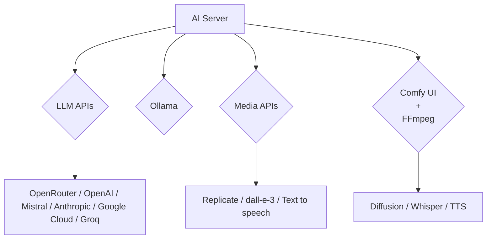

AI Server is a way to orchestrate your AI requests through a single self-hosted application to control what AI Providers you use without impacting your client integrations. It serves as a private gateway to process LLM, AI, and image transformation requests, dynamically delegating tasks across multiple providers including Ollama, OpenRouter, Replicate, Comfy UI, utilizing models like Whisper, SDXL, Flux, and tools like ffmpeg.

## Key Features

- **Unified AI Gateway**: Centralize all your AI requests through a single self-hosted service.
- **Multi-Provider Support**: Seamlessly integrate with Ollama, Open AI, Comfy UI, and more.
- **Type-Safe Integrations**: Native end-to-end typed integrations for 11 popular languages.
- **Secure Access**: API key authentication to protect your AI resources.
- **Managed File Storage**: Built-in cached storage for AI-generated assets.
- **Background Job Processing**: Efficient handling of long-running AI tasks, capable of distributing workloads.
- **Custom Deployment**: Run as a single Docker container, with optional GPU-equipped agents for advanced tasks.

## Why Use AI Server?

AI Server simplifies the integration and management of AI capabilities in your applications:

1. **Centralized Management**: Manage all your AI providers and requests from a single interface.
2. **Cost Control**: Monitor and control usage across your organization with detailed request history.
3. **Flexibility**: Easy to scale and adapt as your AI needs evolve.
4. **Security**: Keep your AI operations behind your firewall with a private, managed gateway.
5. **Developer-Friendly**: Type-safe APIs and integrations for a smooth development experience.

## Supported AI Capabilities

- **Large Language Models**: Integrate with Open AI Chat, Ollama, and various API gateways including OpenRouter.
- **Image Generation & Transformations**: Leverages ComfyUI Agent self-hosted, and SaaS providers like Replicate.
- **Audio Processing**: Text-to-speech, and speech-to-text with Whisper integration.
- **Video Processing**: Format conversions, scaling, cropping, and more with via ffmpeg.

## Getting Started for Developers

1. **Setup**: Follow the [Quick Start guide](/ai-server/install) to deploy AI Server.
2. **Configuration**: Use the Admin Portal to add your AI providers and generate API keys.
3. **Integration**: Choose your preferred language and use AI Server's type-safe APIs.
4. **Development**: Start making API calls to AI Server from your application, leveraging the full suite of AI capabilities.

## Learn More

- Hosted Example: [openai.servicestack.net](https://openai.servicestack.net)
- Source Code: [github.com/ServiceStack/ai-server](https://github.com/ServiceStack/ai-server)

AI Server is actively developed and continuously expanding its capabilities.